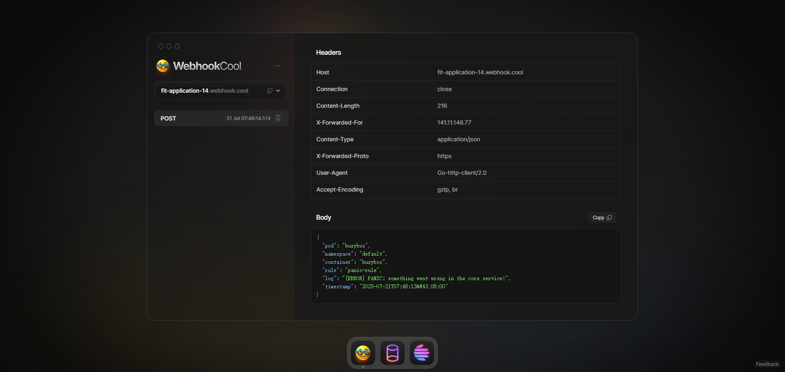

# 🚀 smart-log 快速开始指南
***本指南将引导你在 5 分钟内完成 smart-log 的部署，并成功触发你的第一条实时日志告警。***

## 前提条件
- 一个正在运行的 Kubernetes 集群 (例如 Kind, Minikube, Docker Desktop)。
- 已安装并配置好 kubectl 命令行工具。
- 一个用于接收告警的 Webhook URL，为了方便测试，我们将使用 https://webhook.cool。

## 准备工作：获取测试 Webhook URL
- 用浏览器打开 https://webhook.cool。
- 网站会自动为你生成一个唯一的 URL，格式为 https://fit-application-xx.webhook.cool。
- 复制并保存好这个 URL，并保持该网页打开。任何发送到此 URL 的请求都会实时显示在该页面上。

## 开发者部署 smart-log Controller
- 首先，我们需要将 smart-log 的自定义资源定义 (CRDs) 和控制器部署到你的 Kubernetes 集群中。
```text
$ make manifests
$ make install
$ make generate
$ make run
```
- 检查 CRD 资源定义是否正确生成。
```text
root@kube-dev-master-1:~/alert# kubectl api-resources | grep smart
alertgroups                         ag                                              smartlog.smart-tools.com/v1alpha1   true         AlertGroup
alerts                              alt                                             smartlog.smart-tools.com/v1alpha1   true         Alert
monitorpods                         mp                                              smartlog.smart-tools.com/v1alpha1   true         MonitorPod
```

- 确保 smart-log 控制器已成功启动，并监听了 CRD 资源。
- 创建以下一系列资源测试 smart-log 的功能。
```yaml
apiVersion: v1
kind: Secret
metadata:
  name: webhook-secret
type: Opaque
stringData:
  url: "https://fit-application-14.webhook.cool"
---
apiVersion: smartlog.smart-tools.com/v1alpha1
kind: Alert
metadata:
  name: webhook-alert
spec:
  type: WebHook
  webhook:
    urlSecretRef:
      name: webhook-secret
      key: url
```
```yaml
apiVersion: v1
kind: Pod
metadata:
  name: busybox
  labels:
    app: log
spec:
  containers:
  - name: busybox
    image: busybox:1.28
    command: ["/bin/sh", "-c"]
    args:
    - |
      while true; do
        echo "[INFO] System is running normally at $(date)"
        sleep 10
        echo "[ERROR] PANIC: something went wrong in the core service!"
      done
---
apiVersion: smartlog.smart-tools.com/v1alpha1
kind: MonitorPod
metadata:
  name: monitor-busybox
spec:
  selector:
    matchLabels:
      app: log
  rules:
    - name: "panic-rule"
      regex: "PANIC:.*"
  alertTarget:
    kind: Alert
    name: webhook-alert
  rateLimit:
    period: "1m"
    limit: 1
  alertTemplate: |
    {
      "pod": "{{ .PodName }}",
      "namespace": "{{ .Namespace }}",
      "container": "{{ .ContainerName }}",
      "rule": "{{ .RuleName }}",
      "log": "{{ .LogLine }}",
      "timestamp": "{{ .Timestamp.Format "2006-01-02T15:04:05Z07:00" }}"
    }
```
- 创建上述资源后， smart-log 控制器会开始监听 Pod 的标准输出流，并匹配到 panic-rule 规则的日志行。当匹配成功时，smart-log 控制器会触发 webhook-alert 告警，并使用 webhook-alert 的配置将告警发送到 webhook-secret 中保存的 URL。
```text
root@kube-dev-master-1:~/alert# kubectl get alt
NAME            READY   STATUS   AGE
webhook-alert   true    True     23s

root@kube-dev-master-1:~/alert# kubectl get mp
NAME              MONITOREDPODSCOUNT   ALERTSSENTCOUNT   LASTTRIGGEREDTIME   AGE
monitor-busybox   1                    1                 13s                 29s
```

# 🎉 恭喜，恭喜，恭喜！

## 清理测试环境
- 删除测试资源。
```text
kubectl delete -f monitorpod.yaml -f pod.yaml -f alert.yaml -f secret.yaml 
monitorpod.smartlog.smart-tools.com "monitor-busybox" deleted
pod "busybox" deleted
alert.smartlog.smart-tools.com "webhook-alert" deleted
secret "webhook-secret" deleted
```
- 删除 smart-log 运行时环境。
```text
使用 ctrl + c 退出运行时环境
make uninstall
```