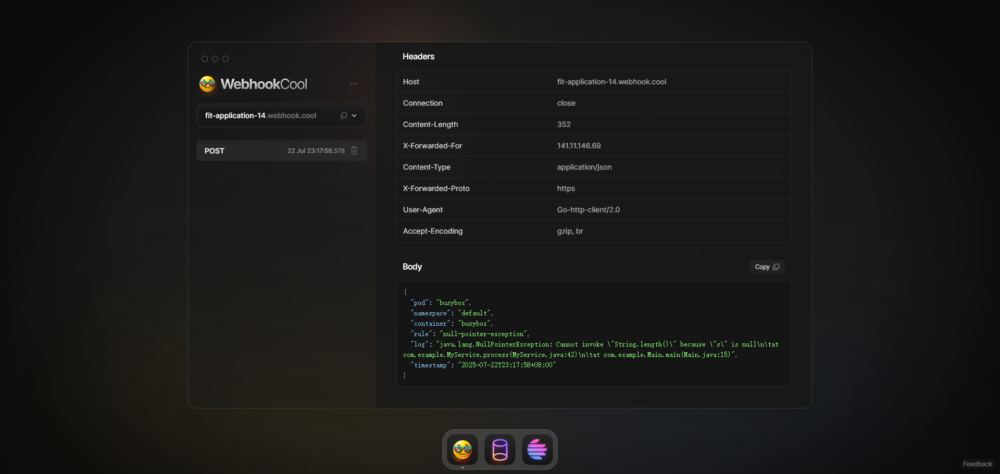

# 🚀 smart-log 快速开始指南
***本指南将引导你在 5 分钟内完成 smart-log 的部署，并成功触发你的第一条实时日志告警。***

## 前提条件
- 一个正在运行的 Kubernetes 集群 (例如 Kind, Minikube, Docker Desktop)。
- 已安装并配置好 kubectl 命令行工具。
- 一个用于接收告警的 Webhook URL，为了方便测试，我们将使用 https://webhook.cool。

## 准备工作：获取测试 Webhook URL
- 用浏览器打开 https://webhook.cool。
- 网站会自动为你生成一个唯一的 URL，格式为 https://fit-application-xx.webhook.cool。
- 复制并保存好这个 URL，并保持该网页打开。任何发送到此 URL 的请求都会实时显示在该页面上。

## 开发者部署 smart-log Controller
- 首先，我们需要将 smart-log 的自定义资源定义 (CRDs) 和控制器部署到你的 Kubernetes 集群中。
```text
# 1. 生成并安装 CRD
make manifests
make install

# 2. 生成代码
make generate

# 3. 在本地运行 Controller 以方便观察日志
make run
```
## 检查 CRD 资源定义是否正确生成。 
#### 运行以下命令，确保所有 CRD 都已成功注册到集群中。
```text
kubectl api-resources | grep smart
```
```text
alertgroups                         ag                                              smartlog.smart-tools.com/v1alpha1   true         AlertGroup
alertrecords                        ar                                              smartlog.smart-tools.com/v1alpha1   true         AlertRecord
alerts                              alt                                             smartlog.smart-tools.com/v1alpha1   true         Alert
monitorpods                         mp                                              smartlog.smart-tools.com/v1alpha1   true         MonitorPod
```

## 场景一：基础功能测试 (单行日志告警)
#### 这个场景将验证 smart-log 的核心功能：监控单行日志并触发 Webhook 告警。

- 确保 smart-log 控制器已成功启动，并监听了 CRD 资源。
- 创建以下一系列资源测试 smart-log 的功能。
```yaml
apiVersion: v1
kind: Secret
metadata:
  name: webhook-secret
type: Opaque
stringData:
  url: "https://fit-application-14.webhook.cool"
---
apiVersion: smartlog.smart-tools.com/v1alpha1
kind: Alert
metadata:
  name: webhook-alert
spec:
  type: WebHook
  webhook:
    urlSecretRef:
      name: webhook-secret
      key: url
```
```yaml
apiVersion: v1
kind: Pod
metadata:
  name: busybox
  labels:
    app: log
spec:
  containers:
  - name: busybox
    image: busybox:1.28
    command: ["/bin/sh", "-c"]
    args:
    - |
      while true; do
        echo "[INFO] System is running normally at $(date)"
        sleep 10
        echo "[ERROR] PANIC: something went wrong in the core service!"
      done
---
apiVersion: smartlog.smart-tools.com/v1alpha1
kind: MonitorPod
metadata:
  name: monitor-busybox
spec:
  selector:
    matchLabels:
      app: log
  rules:
    - name: "panic-rule"
      regex: "PANIC:.*"
  alertTarget:
    kind: Alert
    name: webhook-alert
  rateLimit:
    period: "1m"
    limit: 1
  alertTemplate: |
    {
      "pod": "{{ .PodName }}",
      "namespace": "{{ .Namespace }}",
      "container": "{{ .ContainerName }}",
      "rule": "{{ .RuleName }}",
      "log": "{{ .LogLine }}",
      "timestamp": "{{ .Timestamp.Format "2006-01-02T15:04:05Z07:00" }}"
    }
```
- 创建上述资源后， smart-log 控制器会开始监听 Pod 的标准输出流，并匹配到 panic-rule 规则的日志行。当匹配成功时，smart-log 控制器会触发 webhook-alert 告警，并使用 webhook-alert 的配置将告警发送到 webhook-secret 中保存的 URL。
```text
root@kube-dev-master-1:~/alert# kubectl get alt
NAME            READY   STATUS   AGE
webhook-alert   true    True     23s

root@kube-dev-master-1:~/alert# kubectl get mp
NAME              MONITOREDPODSCOUNT   ALERTSSENTCOUNT   LASTTRIGGEREDTIME   AGE
monitor-busybox   1                    1                 13s                 29s
```


## 场景二：进阶功能测试 (多行日志 & 告警记录)
#### 这个场景将验证我们新增的多行日志处理和告警历史记录与自动清理功能。

- 创建测试资源
```yaml
apiVersion: v1
kind: Secret
metadata:
  name: webhook-secret
type: Opaque
stringData:
  url: "https://fit-application-14.webhook.cool"
---
apiVersion: smartlog.smart-tools.com/v1alpha1
kind: Alert
metadata:
  name: webhook-alert
spec:
  type: Webhook
  webhook:
    urlSecretRef:
      name: webhook-secret
      key: url
```
```yaml
apiVersion: v1
kind: Pod
metadata:
  name: busybox
  labels:
    app: log
spec:
  containers:
  - name: busybox
    image: busybox:1.28
    command: ["/bin/sh", "-c"]
    args:
    - |
      while true; do
        echo "2025-07-22 10:30:00 INFO: Processing user request..."
        sleep 15
        echo "2025-07-22 10:30:15 ERROR: An unexpected error occurred"
        echo "java.lang.NullPointerException: Cannot invoke \"String.length()\" because \"s\" is null"
        echo "	at com.example.MyService.process(MyService.java:42)"
        echo "	at com.example.Main.main(Main.java:15)"
      done
```
```yaml
apiVersion: smartlog.smart-tools.com/v1alpha1
kind: MonitorPod
metadata:
  name: monitor-busybox
spec:
  recordAlerts: true
  alertRecordTTL: "1m"
  selector:
    matchLabels:
      app: log
  multiline:
    pattern: '^[^\s\t]'
  rules:
    - name: "null-pointer-exception"
      regex: "java.lang.NullPointerException"
  alertTarget:
    kind: Alert
    name: webhook-alert
  rateLimit:
    period: "1m"
    limit: 1
  alertTemplate: |
    {
      "pod": "{{ .PodName }}",
      "namespace": "{{ .Namespace }}",
      "container": "{{ .ContainerName }}",
      "rule": "{{ .RuleName }}",
      "log": "{{ .LogLine }}",
      "timestamp": "{{ .Timestamp.Format "2006-01-02T15:04:05Z07:00" }}"
    }
```
#### 验证多行日志处理
- 创建上述资源后， smart-log 控制器会开始监听 Pod 的标准输出流，并匹配到 null-pointer-exception 规则的日志行。当匹配成功时，smart-log 控制器会触发 webhook-alert 告警，并使用 webhook-alert 的配置将告警发送到 webhook-secret 中保存的 URL。
- 同时当开启了 recordAlerts 功能时，smart-log 控制器会记录匹配到的日志行，并保存在 AlertRecord 资源中。
```text
root@kube-dev-master-1:~/multiline-alert# kubectl get mp
NAME              READY   MONITORED   ALERTS SENT   LAST ALERT   AGE
monitor-busybox   True    1           1             54s          69s
root@kube-dev-master-1:~/multiline-alert# kubectl get ar
NAME                                           MONITORPOD        RULE                     SOURCE POD   TRIGGERED AT   AGE
monitor-busybox-null-pointer-exception-k4zw9   monitor-busybox   null-pointer-exception   busybox      2s             2s
```
#### 验证告警历史记录与自动清理功能
```text
root@kube-dev-master-1:~/multiline-alert# kubectl get ar,mp
NAME                                                                                MONITORPOD        RULE                     SOURCE POD   TRIGGERED AT   AGE
alertrecord.smartlog.smart-tools.com/monitor-busybox-null-pointer-exception-z2bfs   monitor-busybox   null-pointer-exception   busybox      17s            17s

NAME                                                  READY   MONITORED   ALERTS SENT   LAST ALERT   AGE
monitorpod.smartlog.smart-tools.com/monitor-busybox   True    1           3             17s          2m40s
```


# 🎉 恭喜，恭喜，恭喜！
### 你已经成功验证了 smart-log 的所有核心功能！

## 清理测试环境
- 删除测试资源。
```text
# 删除所有测试资源
kubectl delete -f .

# 停止本地运行的 Controller
# 在 `make run` 的终端中使用 ctrl + c 退出

# 从集群中卸载 CRD
make uninstall
```